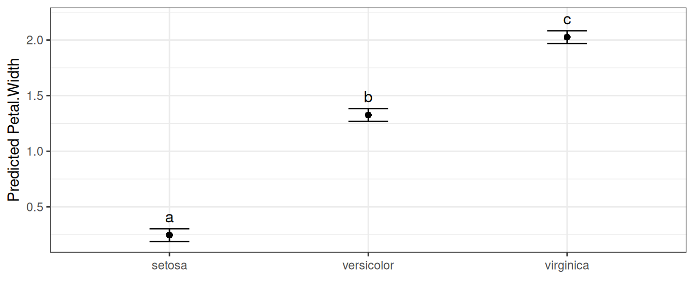
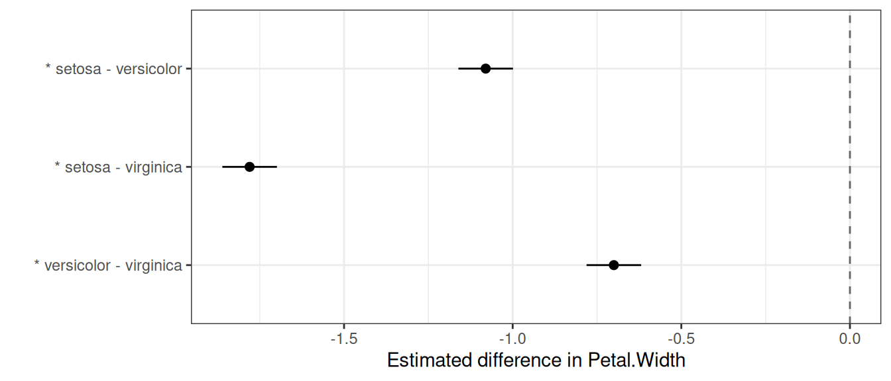
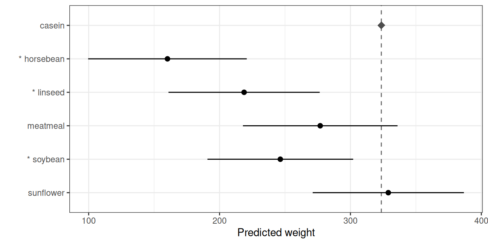
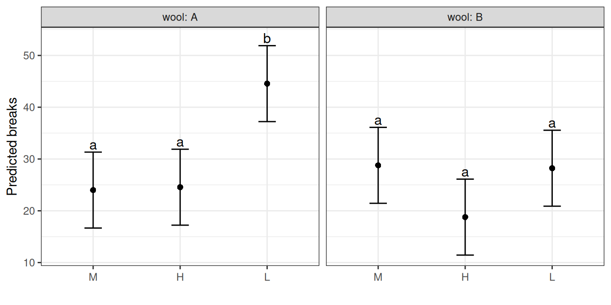

# Choosing and interpreting multiple comparisons

``` r

library(biometryassist)
```

## Introduction

After fitting a model, a common next step is to compare predicted
treatment means. `biometryassist` provides three complementary functions
for this, and which one you want depends on *what you are comparing*:

- **[`multiple_comparisons()`](https://biometryhub.github.io/biometryassist/reference/multiple_comparisons.md)**
  is **means-centric**. It returns one row per treatment level (mean,
  standard error, confidence interval) and summarises the *complete* set
  of all pairwise comparisons with a compact letter display (treatments
  that share a letter show no evidence of a difference).
- **[`pairwise_comparisons()`](https://biometryhub.github.io/biometryassist/reference/pairwise_comparisons.md)**
  is **difference-centric**. It returns a tidy table with one row per
  requested comparison, and is the honest representation when you care
  about only *some* of the comparisons, or about general contrasts.
- **[`reference_comparisons()`](https://biometryhub.github.io/biometryassist/reference/reference_comparisons.md)**
  is **means-centric**, for the specific question “how does each
  treatment compare to a single control?”. It reports each level’s mean,
  the reference mean and the adjusted difference, using an exact Dunnett
  test by default.

“Means-centric” and “difference-centric” describe how each function
**presents** its results, not what it tests. All three rest on the same
underlying pairwise differences between predicted means (more generally,
linear contrasts):
[`multiple_comparisons()`](https://biometryhub.github.io/biometryassist/reference/multiple_comparisons.md)
tests *every* pairwise difference and condenses them into letters on the
means (it does not test the means themselves), whereas
[`pairwise_comparisons()`](https://biometryhub.github.io/biometryassist/reference/pairwise_comparisons.md)
and
[`reference_comparisons()`](https://biometryhub.github.io/biometryassist/reference/reference_comparisons.md)
report a chosen subset of those differences directly.

The rest of this vignette tours the three functions on shared example
data, then covers the cross-cutting topics: choosing a multiplicity
adjustment, the shared `adjust` and `by` arguments, confidence
intervals, and a summary guide to picking the right function. All
examples use built-in data and
[`aov()`](https://rdrr.io/r/stats/aov.html) so they run without any
specialised modelling packages, but all three functions work across the
supported model types (`aov`, `lm`, `aovlist`, `asreml`, `lmerMod` and
`lme`).

## The three functions in action

We start with the `iris` data and a one-way model for petal width, and
reuse it across the first three subsections so the same analysis can be
seen from each function’s perspective.

``` r

model <- aov(Petal.Width ~ Species, data = iris)
```

### `multiple_comparisons()`: all pairs, means and letters

[`multiple_comparisons()`](https://biometryhub.github.io/biometryassist/reference/multiple_comparisons.md)
compares *every* pair of means and summarises the result as a letter
display on the means, using Tukey’s HSD by default:

``` r

multiple_comparisons(model, classify = "Species")
## Multiple Comparisons of Means: Tukey's HSD Test
## Significance level: 0.05 
## HSD value: 0.0969097 
## 
## Predicted values:
##      Species predicted.value std.error  df groups   ci  low   up
## 1     setosa            0.25      0.03 147      a 0.06 0.19 0.30
## 2 versicolor            1.33      0.03 147      b 0.06 1.27 1.38
## 3  virginica            2.03      0.03 147      c 0.06 1.97 2.08
```

Each row is a treatment mean; treatments that share a letter show no
evidence of a difference.
[`autoplot()`](https://biometryhub.github.io/biometryassist/reference/autoplot.md)
draws the means with their intervals and letters:

``` r

autoplot(multiple_comparisons(model, classify = "Species"), label_height = 0.95)
```



The letter display is a compact summary of *all* pairwise comparisons at
once. Because every pair has been compared, “share a letter” means “no
evidence of a difference” — but that interpretation is only valid for
the **complete** set (see [The same model, several
views](#the-same-model-several-views)).

### `pairwise_comparisons()`: a chosen set of differences

[`pairwise_comparisons()`](https://biometryhub.github.io/biometryassist/reference/pairwise_comparisons.md)
reports the comparisons themselves, one per row. By default it tests
**all** pairwise differences and adjusts the p-values with Holm’s
method:

``` r

pairwise_comparisons(model, classify = "Species")
## Pairwise comparisons of means
## Classify: Species 
## Adjustment method: holm 
## Significance level: 0.05 
## 
##       level1     level2             comparison estimate level1.mean level2.mean
## 1     setosa versicolor    setosa - versicolor    -1.08        0.25        1.33
## 2     setosa  virginica     setosa - virginica    -1.78        0.25        2.03
## 3 versicolor  virginica versicolor - virginica    -0.70        1.33        2.03
##   std.error statistic  df  p.value conf.low conf.high
## 1      0.04    -26.39 147 2.51e-57    -1.16     -1.00
## 2      0.04    -43.49 147 2.39e-85    -1.86     -1.70
## 3      0.04    -17.10 147 8.82e-37    -0.78     -0.62
```

Each row is a difference: `estimate` is `mean(level1) - mean(level2)`,
with `level1`/`level2` making the direction explicit and the
`level1.mean` / `level2.mean` columns reporting the two predicted means
it is computed from. If you care about only a specific set of
comparisons, pass them via `pairs` — the multiplicity adjustment is then
applied over just that set:

``` r

pairwise_comparisons(
  model,
  classify = "Species",
  pairs = c("setosa-versicolor", "versicolor-virginica")
)
## Pairwise comparisons of means
## Classify: Species 
## Adjustment method: holm 
## Significance level: 0.05 
## 
##       level1     level2             comparison estimate level1.mean level2.mean
## 1     setosa versicolor    setosa - versicolor    -1.08        0.25        1.33
## 2 versicolor  virginica versicolor - virginica    -0.70        1.33        2.03
##   std.error statistic  df  p.value conf.low conf.high
## 1      0.04    -26.39 147 2.51e-57    -1.16     -1.00
## 2      0.04    -17.10 147 8.82e-37    -0.78     -0.62
```

[`autoplot()`](https://biometryhub.github.io/biometryassist/reference/autoplot.md)
draws a forest plot of the differences, with a dashed line at zero and
an asterisk marking comparisons that are significant at the (adjusted)
level:

``` r

autoplot(pairwise_comparisons(model, classify = "Species"))
```



#### General contrasts

Sometimes the comparison of interest isn’t a single pair. The
`contrasts` argument tests any linear contrast — for example, *setosa*
versus the average of the other two species:

``` r

pairwise_comparisons(
  model,
  classify = "Species",
  contrasts = list(
    "setosa vs rest" = c(setosa = 1, versicolor = -0.5, virginica = -0.5)
  )
)
## Contrasts of means
## Classify: Species 
## Adjustment method: holm 
## Significance level: 0.05 
## 
##       comparison estimate std.error statistic  df  p.value conf.low conf.high
## 1 setosa vs rest    -1.43      0.04    -40.34 147 2.12e-81     -1.5     -1.36
```

Each contrast is a named vector of coefficients (which should sum to
zero) and the list name becomes the row label. A two-level contrast such
as `c(A = 1, B = -1)` is exactly the pairwise difference `"A-B"`.

### `reference_comparisons()`: each level against a control

When the question is specifically “how does each treatment compare to a
single control?”,
[`reference_comparisons()`](https://biometryhub.github.io/biometryassist/reference/reference_comparisons.md)
is the natural tool. It is means-centric like
[`multiple_comparisons()`](https://biometryhub.github.io/biometryassist/reference/multiple_comparisons.md),
but only the comparisons against the chosen reference are made — and
because every comparison shares that reference, significance attaches
cleanly to each treatment (which a letter display cannot do for an
incomplete set; see [The same model, several
views](#the-same-model-several-views)).

Switching to the `chickwts` data (chick weights by feed type), we
compare every feed to the `casein` control:

``` r

model_cw <- aov(weight ~ feed, data = chickwts)
reference_comparisons(model_cw, classify = "feed", reference = "casein")
## Comparisons against a reference level
## Classify: feed 
## Reference: casein 
## Adjustment method: dunnett 
## Significance level: 0.05 
## 
##      level1 level2         comparison estimate level1.mean level2.mean
## 1 horsebean casein horsebean - casein  -163.38      160.20      323.58
## 2   linseed casein   linseed - casein  -104.83      218.75      323.58
## 3  meatmeal casein  meatmeal - casein   -46.67      276.91      323.58
## 4   soybean casein   soybean - casein   -77.15      246.43      323.58
## 5 sunflower casein sunflower - casein     5.33      328.92      323.58
##   std.error statistic df  p.value conf.low conf.high
## 1     23.49     -6.96 65 5.65e-09  -223.89   -102.88
## 2     22.39     -4.68 65 7.84e-05  -162.53    -47.14
## 3     22.90     -2.04 65 1.67e-01  -105.66     12.31
## 4     21.58     -3.58 65 3.11e-03  -132.75    -21.56
## 5     22.39      0.24 65 9.99e-01   -52.36     63.03
```

Each row gives the mean of a feed (`level1.mean`), the mean of the
control (`level2.mean`) and their difference, with the adjustment
defaulting to the exact Dunnett test. The
[`autoplot()`](https://biometryhub.github.io/biometryassist/reference/autoplot.md)
method draws each feed’s mean, a dashed line at the control mean (marked
with a diamond), and an interval for the difference from the control, so
the interval clears the control line exactly when the comparison is
significant; significant feeds are also flagged with an asterisk:

``` r

autoplot(reference_comparisons(model_cw, classify = "feed", reference = "casein"))
```



### The same model, several views

The three functions are different *views* of the same fitted model, not
different tests. On the iris model,
[`multiple_comparisons()`](https://biometryhub.github.io/biometryassist/reference/multiple_comparisons.md)
and an all-pairs
[`pairwise_comparisons()`](https://biometryhub.github.io/biometryassist/reference/pairwise_comparisons.md)
rest on identical pairwise differences — one presents them as
means-with-letters, the other as a table of differences. Both are
correct; they answer different questions:

- the **letter display**
  ([`multiple_comparisons()`](https://biometryhub.github.io/biometryassist/reference/multiple_comparisons.md))
  is a compact summary of the *complete* set of pairwise comparisons,
  valid only because every pair is compared;
- the **difference table**
  ([`pairwise_comparisons()`](https://biometryhub.github.io/biometryassist/reference/pairwise_comparisons.md))
  is the honest representation when the set is incomplete or irregular —
  forcing letters onto such a set would silently assert “not different”
  for pairs that were never tested;
- the **reference table**
  ([`reference_comparisons()`](https://biometryhub.github.io/biometryassist/reference/reference_comparisons.md))
  is the right view when one level is a control, where significance
  attaches to each treatment directly.

So the choice of function follows from the *question*, not from the
model.

## Controlling error across comparisons

Testing several comparisons inflates the chance of at least one false
positive, so p-values are adjusted. There are two broad families of
error rate, and the right choice depends on your goal.

**Family-wise error rate (FWER)** is the probability of making *any*
false rejection across the whole family. It is the conservative, “every
claim must be trustworthy” criterion, appropriate for a small set of
planned comparisons.

- **Bonferroni** is the simplest FWER method, but quite conservative:
  Holm controls the same error rate and is uniformly more powerful, so
  there is essentially never a reason to prefer plain Bonferroni over
  Holm.
- **Holm** ([Holm 1979](#ref-holm1979)) is a step-down procedure that
  controls the FWER under *any* dependence structure. It is the default
  in
  [`pairwise_comparisons()`](https://biometryhub.github.io/biometryassist/reference/pairwise_comparisons.md).
- **Tukey’s HSD** ([Tukey 1953](#ref-tukey1953); [Hsu
  1996](#ref-hsu1996)) uses the studentized range distribution to give
  *exact* simultaneous FWER control for the complete set of **all**
  pairwise comparisons (exact for equal replication; the Tukey–Kramer
  extension covers unequal replication). Because it exploits the exact
  joint distribution of all pairwise differences, it is more powerful
  than Bonferroni or Holm *for that complete set* — which is why it is
  the default in
  [`multiple_comparisons()`](https://biometryhub.github.io/biometryassist/reference/multiple_comparisons.md).
- **Dunnett’s test** ([Dunnett 1955](#ref-dunnett1955)) is the exact
  FWER procedure for the specific family of comparing every treatment
  against a *single control*. Like Tukey for all pairs, it exploits the
  known joint distribution of those comparisons (the correlation induced
  by the shared control), so it is more powerful than a generic
  adjustment for that family. It is the default in
  [`reference_comparisons()`](https://biometryhub.github.io/biometryassist/reference/reference_comparisons.md).

**False discovery rate (FDR)** is the expected *proportion* of false
rejections among the rejected comparisons. It is less stringent than
FWER and earns its keep when comparisons are many and somewhat
exploratory, such as in plant breeding.

- **Benjamini–Hochberg (`"BH"`/`"fdr"`)** ([Benjamini and Hochberg
  1995](#ref-benjamini1995)) controls the FDR under independence and
  positive dependence (which pairwise comparisons satisfy); **`"BY"`**
  is valid under arbitrary dependence but more conservative.

### Why Tukey is reserved for the complete (all-pairs) set

A natural question is why
[`pairwise_comparisons()`](https://biometryhub.github.io/biometryassist/reference/pairwise_comparisons.md)
and
[`reference_comparisons()`](https://biometryhub.github.io/biometryassist/reference/reference_comparisons.md)
do not offer `adjust = "tukey"`. Tukey’s critical value is calibrated to
the largest difference among *all* the means; applied to a chosen subset
it still controls the FWER, but it is sized for comparisons you are not
making, so it is overly conservative and conceptually mismatched ([Hsu
1996](#ref-hsu1996); [Bretz et al. 2010](#ref-bretz2010)). For a
selected set, a method calibrated to *that* set (Holm, Bonferroni, BH)
is preferred; for the all-vs-control set, Dunnett is the calibrated
choice. Conversely, for the complete set Tukey is the most powerful of
these because it uses the known structure of the pairwise differences.
So Tukey belongs with the complete-set, means-and-letters analysis
([`multiple_comparisons()`](https://biometryhub.github.io/biometryassist/reference/multiple_comparisons.md)),
and the other two functions reject it with an informative error pointing
you there.

Because all three functions share the same predicted means and standard
errors of differences, **testing all pairs in
[`pairwise_comparisons()`](https://biometryhub.github.io/biometryassist/reference/pairwise_comparisons.md)
with a given `adjust` reproduces the adjusted p-values of
[`multiple_comparisons()`](https://biometryhub.github.io/biometryassist/reference/multiple_comparisons.md)
with the same `adjust`** — only the presentation differs (a table of
differences versus means and letters). The one exception is Tukey, for
the reasons above.

## The shared `adjust` and `by` arguments

All three functions take `adjust` and `by`, with the same meaning
throughout.

### `adjust`: choosing the multiplicity method

`adjust` selects the p-value adjustment from the previous section. Each
function has a sensible default (Tukey for
[`multiple_comparisons()`](https://biometryhub.github.io/biometryassist/reference/multiple_comparisons.md),
Holm for
[`pairwise_comparisons()`](https://biometryhub.github.io/biometryassist/reference/pairwise_comparisons.md),
Dunnett for
[`reference_comparisons()`](https://biometryhub.github.io/biometryassist/reference/reference_comparisons.md)),
but any [`stats::p.adjust()`](https://rdrr.io/r/stats/p.adjust.html)
method can be requested instead — for example Bonferroni:

``` r

mc <- multiple_comparisons(model, classify = "Species", adjust = "bonferroni")
mc$comparison_method
## [1] "bonferroni"
```

The only restriction is that the calibrated methods are tied to their
family: `"tukey"` is accepted only by
[`multiple_comparisons()`](https://biometryhub.github.io/biometryassist/reference/multiple_comparisons.md)
and `"dunnett"` only by
[`reference_comparisons()`](https://biometryhub.github.io/biometryassist/reference/reference_comparisons.md)
(see the previous section).

### `by`: comparisons within subgroups

`by` runs the comparisons **independently within subgroups** — useful
for a factorial where you want to compare one factor *within* each level
of another, rather than across the whole experiment. Each subgroup is a
separate family, with no pooling or adjustment across groups. Using the
`warpbreaks` data (number of breaks by `wool` type and `tension`):

``` r

wb <- aov(breaks ~ wool * tension, data = warpbreaks)
```

Comparing `tension` levels within each `wool` type, the comparison
labels refer to the remaining (non-`by`) factor:

``` r

pairwise_comparisons(wb, classify = "wool:tension", by = "wool")
## Pairwise comparisons of means
## Classify: wool:tension 
## Adjustment method: holm 
## Significance level: 0.05 
## 
##   wool level1 level2 comparison estimate level1.mean level2.mean std.error
## 1    A      L      M      L - M    20.56       44.56       24.00      5.16
## 2    A      L      H      L - H    20.00       44.56       24.56      5.16
## 3    A      M      H      M - H    -0.56       24.00       24.56      5.16
## 4    B      L      M      L - M    -0.56       28.22       28.78      5.16
## 5    B      L      H      L - H     9.44       28.22       18.78      5.16
## 6    B      M      H      M - H    10.00       28.78       18.78      5.16
##   statistic df  p.value conf.low conf.high
## 1      3.99 48 0.000684    10.19     30.93
## 2      3.88 48 0.000684     9.63     30.37
## 3     -0.11 48 0.915000   -10.93      9.81
## 4     -0.11 48 0.915000   -10.93      9.81
## 5      1.83 48 0.175000    -0.93     19.81
## 6      1.94 48 0.175000    -0.37     20.37
```

`by` behaves the same way in the other two functions. In
[`multiple_comparisons()`](https://biometryhub.github.io/biometryassist/reference/multiple_comparisons.md)
the letter display restarts within each subgroup and
[`autoplot()`](https://biometryhub.github.io/biometryassist/reference/autoplot.md)
facets the means and letters by the `by` variable:

``` r

autoplot(multiple_comparisons(wb, classify = "wool:tension", by = "wool"))
```



## A note on confidence intervals

The intervals shown by
[`pairwise_comparisons()`](https://biometryhub.github.io/biometryassist/reference/pairwise_comparisons.md)
and
[`reference_comparisons()`](https://biometryhub.github.io/biometryassist/reference/reference_comparisons.md)
(and their plots) are *per-comparison* intervals — except for Dunnett,
they are **not** adjusted for simultaneity. Significance, on the other
hand, is judged by the multiplicity-adjusted p-value. These two can
disagree: an interval may exclude zero while the adjusted p-value is no
longer below `sig`, and both functions emit a one-time note when this
happens in a result. (Dunnett is the exception: its intervals *are* the
simultaneous intervals, so for
[`reference_comparisons()`](https://biometryhub.github.io/biometryassist/reference/reference_comparisons.md)
with its default they agree with the test by construction.) This is the
same tension that the `int.type` options address in
[`multiple_comparisons()`](https://biometryhub.github.io/biometryassist/reference/multiple_comparisons.md).
So in a forest plot, read significance from the asterisk (which tracks
the adjusted test), not from whether the drawn interval happens to cross
zero.

## Choosing the right function: a summary

Match the function to the question you are asking:

- **All pairwise comparisons, with a compact summary?** Use
  [`multiple_comparisons()`](https://biometryhub.github.io/biometryassist/reference/multiple_comparisons.md)
  (Tukey’s HSD by default, with letter groupings).
- **A specific or planned subset of comparisons, or a general
  contrast?** Use
  [`pairwise_comparisons()`](https://biometryhub.github.io/biometryassist/reference/pairwise_comparisons.md)
  (Holm by default), which represents the chosen set honestly as a table
  of differences.
- **Each treatment against a single control?** Use
  [`reference_comparisons()`](https://biometryhub.github.io/biometryassist/reference/reference_comparisons.md)
  (exact Dunnett by default), which keeps the analysis means-centric.
- **Many, exploratory comparisons where a controlled proportion of false
  positives is acceptable?** Use an FDR method (`adjust = "BH"`).
- **Comparisons within subgroups of a factorial?** Use `by` in any of
  the three.

The same advice as a table:

| Question / comparison type | Function | Default adjustment | Not valid |
|----|----|----|----|
| All pairwise comparisons, summarised with letters | [`multiple_comparisons()`](https://biometryhub.github.io/biometryassist/reference/multiple_comparisons.md) | Tukey’s HSD | `dunnett` |
| A chosen subset of pairs, or general contrasts | [`pairwise_comparisons()`](https://biometryhub.github.io/biometryassist/reference/pairwise_comparisons.md) | Holm | `tukey`, `dunnett` |
| Every treatment vs a single control | [`reference_comparisons()`](https://biometryhub.github.io/biometryassist/reference/reference_comparisons.md) | Dunnett | `tukey` |

Any other [`stats::p.adjust()`](https://rdrr.io/r/stats/p.adjust.html)
method (Holm, Bonferroni, BH, BY, …) can be requested in all three via
`adjust`; only the calibrated methods are restricted to their family, as
shown in the final column.

## References

Benjamini, Yoav, and Yosef Hochberg. 1995. “Controlling the False
Discovery Rate: A Practical and Powerful Approach to Multiple Testing.”
*Journal of the Royal Statistical Society, Series B (Methodological)* 57
(1): 289–300. <https://doi.org/10.1111/j.2517-6161.1995.tb02031.x>.

Bretz, Frank, Torsten Hothorn, and Peter Westfall. 2010. *Multiple
Comparisons Using r*. Chapman & Hall/CRC.

Dunnett, Charles W. 1955. “A Multiple Comparison Procedure for Comparing
Several Treatments with a Control.” *Journal of the American Statistical
Association* 50 (272): 1096–121.
<https://doi.org/10.1080/01621459.1955.10501294>.

Holm, Sture. 1979. “A Simple Sequentially Rejective Multiple Test
Procedure.” *Scandinavian Journal of Statistics* 6 (2): 65–70.

Hothorn, Torsten, Frank Bretz, and Peter Westfall. 2008. “Simultaneous
Inference in General Parametric Models.” *Biometrical Journal* 50 (3):
346–63. <https://doi.org/10.1002/bimj.200810425>.

Hsu, Jason C. 1996. *Multiple Comparisons: Theory and Methods*. Chapman
& Hall.

Miller, Rupert G. 1981. *Simultaneous Statistical Inference*. 2nd ed.
Springer-Verlag.

Tukey, John W. 1953. “The Problem of Multiple Comparisons.” Unpublished
manuscript.

\`\`\`
