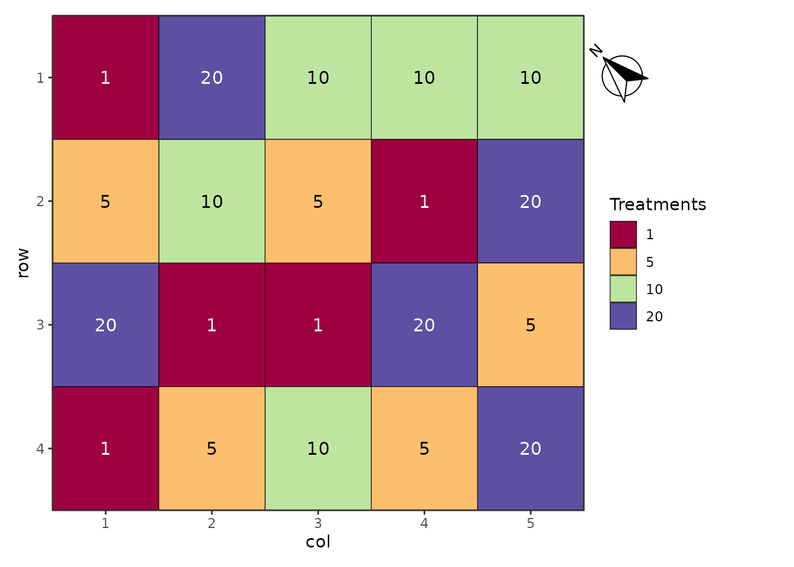
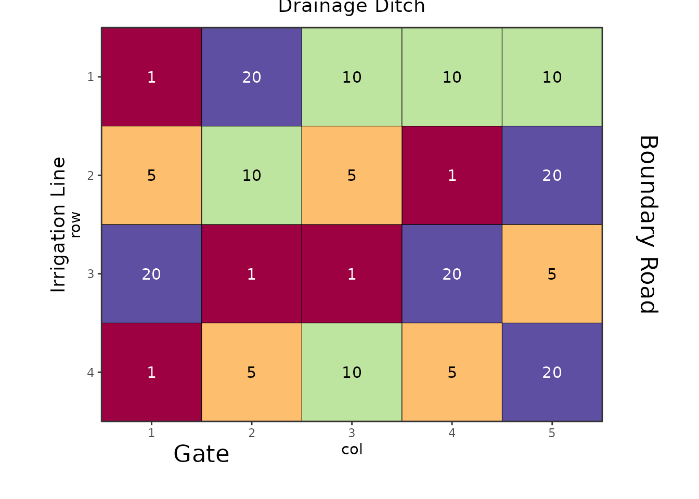
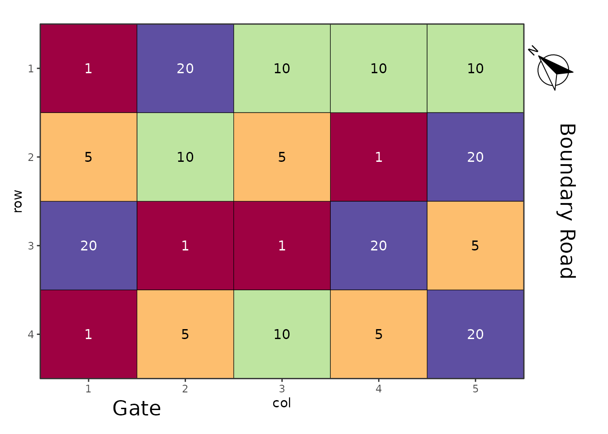
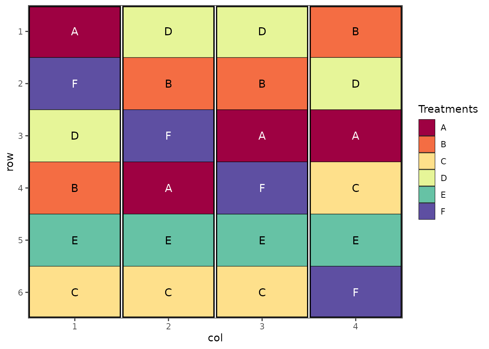
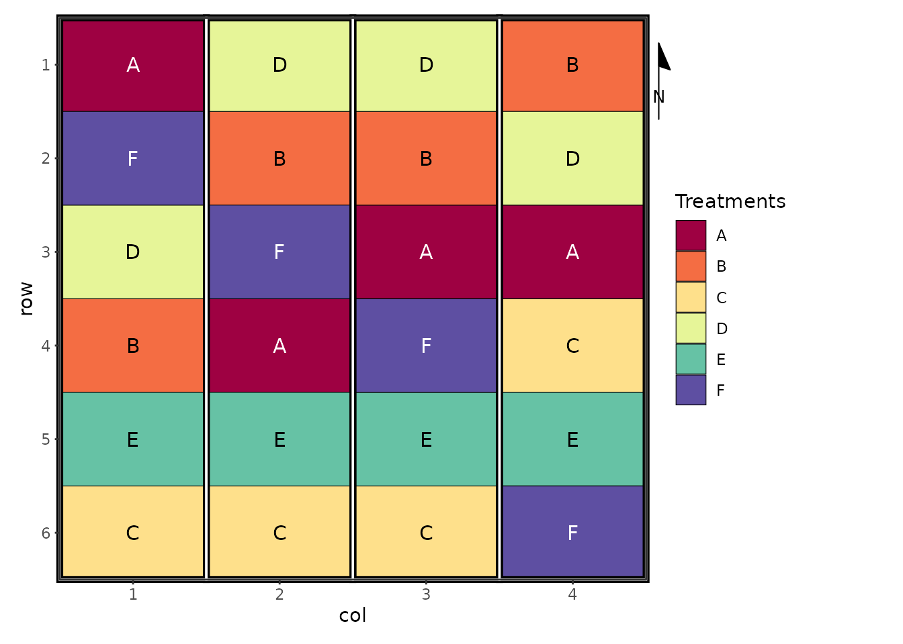

# Adding Orientation Arrows and Annotations to Field Layout Plots

## Introduction

When presenting field trial layouts, it’s often important to provide
spatial context through orientation arrows (indicating north or other
directions) and annotations that reference physical features of the
field (such as boundaries, gates, or adjacent landmarks). This vignette
demonstrates how to add these elements to field layout plots generated
by the `biometryassist` package.

The `biometryassist` package generates field layout plots as `ggplot2`
objects, which means we can enhance them using standard `ggplot2`
functions and extensions. This vignette will show you how to:

1.  Add orientation arrows with arbitrary rotation
2.  Add text annotations outside the plotting area to label field
    features

## Setup

First, let’s load the required packages and generate a basic
experimental design:

``` r
library(biometryassist)
library(ggplot2)
library(ggspatial)

# Generate a completely randomized design (CRD)
des.out <- design(
  type = "crd", 
  treatments = c(1, 5, 10, 20),
  reps = 5, 
  nrows = 4, 
  ncols = 5, 
  seed = 42
)
Source of Variation                     df
=============================================
treatments                              3
Residual                                16
=============================================
Total                                   19
```


The
[`design()`](https://biometryhub.github.io/biometryassist/reference/design.md)
function creates a field layout and stores it in `des.out$plot.des` as a
`ggplot2` object. We can now enhance this plot with additional
annotations.

## Adding an Orientation Arrow

Orientation arrows help readers understand the spatial layout of a field
trial relative to cardinal directions or other reference points. This is
particularly useful when field orientation affects environmental
conditions like sun exposure or prevailing winds.

### Using ggspatial for North Arrows

The `ggspatial` package provides the `annotation_north_arrow()`
function, which is specifically designed for adding directional arrows
to plots. While it’s primarily intended for spatial data with coordinate
reference systems, it works well for field layout plots too.

``` r
des.out$plot.des + 
  annotation_north_arrow(
    location = "tr",
    rotation = 53,
    pad_x = unit(-1.5, "cm"),
    pad_y = unit(0.5, "cm"),
    style = north_arrow_fancy_orienteering(
      line_width = 1,
      text_size = 10
    )
  ) +
  coord_cartesian(clip = "off") +
  theme(plot.margin = margin(t = 10, r = 50, b = 10, l = 10, unit = "pt"))
```



Let’s break down each component of this code:

**`annotation_north_arrow()` arguments:**

- `location = "tr"`: Places the arrow in the top-right corner. Other
  options include `"tl"` (top-left), `"bl"` (bottom-left), `"br"`
  (bottom-right), or you can specify exact coordinates as a numeric
  vector `c(x, y)`.

- `rotation = 53`: Rotates the arrow 53 degrees anti-clockwise from
  north. This allows you to indicate the true field orientation. For
  example, if north in your field is 45 degrees clockwise from the top
  of your plot, use `rotation = 45`. Use `rotation = 0` if north aligns
  with the top of the plot.

- `pad_x = unit(-1.5, "cm")`: Moves the arrow horizontally. Negative
  values move it right, positive values move it left. This allows
  fine-tuning of the arrow position.

- `pad_y = unit(0.5, "cm")`: Moves the arrow vertically. Positive values
  move it down, negative values move it up.

- `style = north_arrow_fancy_orienteering()`: Specifies the visual style
  of the arrow. Other available styles include:

  - `north_arrow_minimal()`: Simple arrow design
  - `north_arrow_nautical()`: Compass-style design
  - `north_arrow_orienteering()`: Classic orienteering map style

  Within each style function, you can customize:

  - `line_width`: Thickness of arrow lines
  - `text_size`: Size of the “N” label

**Additional ggplot2 modifications:**

- `coord_cartesian(clip = "off")`: This is **critical**. By default,
  ggplot2 clips (cuts off) any elements that fall outside the plotting
  area. Setting `clip = "off"` allows the arrow to be drawn outside the
  plot panel, which is necessary when using padding to position it
  beyond the plot boundaries.

- `theme(plot.margin = ...)`: Expands the margins around the plot to
  create space for the arrow. The `margin()` function takes four values:
  top, right, bottom, left. Units are specified with the `unit`
  parameter (here, points). We increase the right margin to `50pt` to
  accommodate the arrow.

### Customizing Arrow Appearance

You can customize the arrow style parameters to match your needs:

``` r
des.out$plot.des + 
  annotation_north_arrow(
    location = "tr",
    rotation = 30,  # Different rotation angle
    pad_x = unit(-1, "cm"),
    pad_y = unit(0.3, "cm"),
    style = north_arrow_minimal(  # Different style
      line_width = 1.5,
      text_size = 12
    )
  ) +
  coord_cartesian(clip = "off") +
  theme(plot.margin = margin(t = 10, r = 50, b = 10, l = 10, unit = "pt"))
```

## Adding Field Feature Annotations

In addition to orientation, it’s often helpful to label physical
features of the field site, such as boundaries, access points, or
adjacent landmarks. These annotations provide practical context for
field operations and help with trial management.

### Using annotate() for Text Labels

The `annotate()` function allows us to add text (and other geometric
objects) to specific locations on the plot. Unlike the north arrow,
these annotations use the plot’s coordinate system.

``` r
des.out$plot.des + 
  annotate(
    "text",
    x = 5.8,
    y = mean(des.out$design$row),
    label = "Boundary Road",
    angle = 270,
    hjust = 0.5,
    vjust = -0.5,
    size = 6
  ) +
  annotate(
    "text",
    x = 1.5,
    y = 5,
    label = "Gate",
    hjust = 0.5,
    vjust = -0.5,
    size = 6
  ) +
  coord_cartesian(xlim = c(0.5, 5.5), ylim = c(0.5, 4.5), clip = "off") +
  theme(plot.margin = margin(t = 10, r = 70, b = 20, l = 10, unit = "pt"),
        legend.position="none")
```


Let’s examine each annotation in detail:

**First annotation - “Boundary Road” (vertical text on right):**

- `"text"`: Specifies that we’re adding a text annotation (other options
  include `"rect"`, `"segment"`, etc.)

- `x = 5.8`: The x-coordinate for the text. Since our plot has 5 columns
  (numbered 1-5), placing it at 5.8 positions it outside the right edge
  of the plot.

- `y = mean(des.out$design$row)`: Centers the text vertically by
  calculating the mean of all row numbers. This ensures the text is
  centered regardless of the number of rows.

- `label = "Boundary Road"`: The text to display.

- `angle = 270`: Rotates the text 270 degrees (or -90 degrees), making
  it read from top to bottom. This is conventional for labels on the
  right side of plots.

- `hjust = 0.5`: Horizontal justification. 0.5 centers the text
  horizontally relative to the x-coordinate.

- `vjust = -0.5`: Vertical justification. Negative values move the text
  away from the plot (outward), while positive values would move it
  toward the plot. This ensures the text doesn’t overlap with the plot
  area.

- `size = 6`: The font size for the text.

**Second annotation - “Gate” (horizontal text on top):**

- `x = 1.5`: Positions the text above column 1.5 (between columns 1 and
  2).

- `y = 5`: Places it above the top row (row 4), outside the plotting
  area.

- `angle` is not specified, so the text remains horizontal (0 degrees).

- Other parameters work similarly to the first annotation.

**Critical settings for external annotations:**

- `coord_cartesian(xlim = c(0.5, 5.5), ylim = c(0.5, 4.5), clip = "off")`:
  - `xlim` and `ylim` explicitly set the visible data range. This is
    **essential** because when we add annotations with coordinates
    outside the data range (like x = 5.8), ggplot2 would normally expand
    the axis limits to include these points, stretching the plot. By
    explicitly setting the limits to match our original plot grid
    (columns 0.5-5.5, rows 0.5-4.5), we prevent this expansion.
  - `clip = "off"` allows drawing outside these limits, so our
    annotations at x = 5.8 and y = 5 are still visible.
- `theme(plot.margin = ...)`: Expands margins to create physical space
  for the text. The right margin is set to `70pt` to accommodate
  “Boundary Road”, and the top margin is `20pt` for “Gate”.

### Understanding the Coordinate System

The field layout plot uses the row and column numbers as coordinates: -
Columns are numbered 1 to `ncols` (here, 1 to 5) - Rows are numbered 1
to `nrows` (here, 1 to 4) - Each plot cell is centered on its integer
coordinates

To position annotations: - **Outside right edge**: Use x \> max column
number (e.g., x = 5.8 when max column is 5) - **Outside top edge**: Use
y \> max row number (e.g., y = 5 when max row is 4) - **Outside left
edge**: Use x \< min column number (e.g., x = 0.2 when min column
is 1) - **Outside bottom edge**: Use y \< min row number (e.g., y = 0.2
when min row is 1)

### Adding Multiple Features

You can add as many annotations as needed by chaining multiple
`annotate()` calls:

``` r
des.out$plot.des + 
  annotate("text", x = 5.8, y = mean(des.out$design$row), 
           label = "Boundary Road", angle = 270, hjust = 0.5, vjust = -0.5, size = 6) +
  annotate("text", x = 1.5, y = 5, 
           label = "Gate", hjust = 0.5, vjust = -0.5, size = 6) +
  annotate("text", x = 0.2, y = mean(des.out$design$row), 
           label = "Irrigation Line", angle = 90, hjust = 0.5, vjust = -0.5, size = 5) +
  annotate("text", x = mean(des.out$design$col), y = 0.2, 
           label = "Drainage Ditch", hjust = 0.5, vjust = 1, size = 5) +
  coord_cartesian(xlim = c(0.5, 5.5), ylim = c(0.5, 4.5), clip = "off") +
  theme(plot.margin = margin(t = 20, r = 70, b = 30, l = 50, unit = "pt"),
        legend.position="none")
```



## Combining Orientation Arrows and Annotations

You can combine both techniques to create a fully annotated field
layout:

``` r
des.out$plot.des + 
  # Add north arrow
  annotation_north_arrow(
    location = "tr",
    rotation = 45,
    pad_x = unit(-1.5, "cm"),
    pad_y = unit(0.5, "cm"),
    style = north_arrow_fancy_orienteering(line_width = 1, text_size = 10)
  ) +
  # Add field feature annotations
  annotate("text", x = 5.8, y = mean(des.out$design$row), 
           label = "Boundary Road", angle = 270, hjust = 0.5, vjust = -0.5, size = 6) +
  annotate("text", x = 1.5, y = 5, 
           label = "Gate", hjust = 0.5, vjust = -0.5, size = 6) +
  # Apply coordinate system and theme adjustments
  coord_cartesian(xlim = c(0.5, 5.5), ylim = c(0.5, 4.5), clip = "off") +
  theme(plot.margin = margin(t = 20, r = 70, b = 20, l = 10, unit = "pt"),
        legend.position="none")
```



## Tips and Best Practices

### Determining Appropriate Coordinates

To find the right coordinates for your annotations:

1.  **Check the design dimensions**: Use `str(des.out$design)` to see
    the row and column ranges
2.  **Use summary functions**:
    [`mean()`](https://rdrr.io/r/base/mean.html),
    [`min()`](https://rdrr.io/r/base/Extremes.html), and
    [`max()`](https://rdrr.io/r/base/Extremes.html) help center or
    position annotations
3.  **Experiment iteratively**: Start with approximate values and adjust
    based on the output

### Adjusting Margins

If your annotations are cut off or too far from the plot:

- **Increase margin** if text is cut off: `margin(t = 30, r = 80, ...)`
- **Decrease margin** if there’s too much white space:
  `margin(t = 10, r = 40, ...)`
- Margins are specified as: top, right, bottom, left

### Text Rotation Guidelines

- `angle = 0`: Horizontal text (default)
- `angle = 90`: Vertical text, reading bottom-to-top
- `angle = 270` or `angle = -90`: Vertical text, reading top-to-bottom
  (conventional for right-side labels)
- `angle = 45`: Diagonal text (sometimes useful for corner annotations)

### Justification Parameters

- `hjust = 0`: Left-aligned
- `hjust = 0.5`: Center-aligned (most common)
- `hjust = 1`: Right-aligned
- `vjust = 0`: Bottom-aligned
- `vjust = 0.5`: Middle-aligned
- `vjust = 1`: Top-aligned

For external annotations, `vjust` values outside 0-1 (like
`vjust = -0.5`) create spacing between the text and the plot edge.

## Working with Different Design Types

These techniques work with any design type generated by
`biometryassist`. Here’s an example with a randomized complete block
design (RCBD):

``` r
# Generate an RCBD
des.rcbd <- design(
  type = "rcbd",
  treatments = LETTERS[1:6],
  reps = 4,
  nrows = 6,
  ncols = 4,
  brows = 6,
  bcols = 1,
  seed = 123
)
Source of Variation                     df
=============================================
Block stratum                           3
---------------------------------------------
treatments                              5
Residual                                15
=============================================
Total                                   23
```



``` r

# Add annotations
des.rcbd$plot.des +
  annotation_north_arrow(
    location = "tr",
    rotation = 0,
    pad_x = unit(-1, "cm"),
    pad_y = unit(0.5, "cm"),
    style = north_arrow_minimal(line_width = 1, text_size = 10)
  ) +
  annotate("text", x = 4.8, y = mean(des.rcbd$design$row),
           label = "Access Road", angle = 270, hjust = 0.5, vjust = -0.5, size = 5) +
  coord_cartesian(xlim = c(0.5, 4.5), ylim = c(0.5, 6.5), clip = "off") +
  theme(plot.margin = margin(t = 10, r = 60, b = 10, l = 10, unit = "pt"))
```



Note how the coordinate limits (`xlim` and `ylim`) are adjusted to match
the dimensions of this design (4 columns, 6 rows).

## Troubleshooting

### Problem: Annotation is cut off

**Solution**: Increase the relevant plot margin using
`theme(plot.margin = margin(...))`. Ensure margins are large enough to
accommodate your text.

### Problem: Plot is stretched or distorted

**Solution**: When using `annotate()` with coordinates outside the plot
range, always specify explicit limits in
`coord_cartesian(xlim = ..., ylim = ...)` to prevent automatic axis
expansion.

### Problem: North arrow is not visible

**Solution**: 1. Check that `coord_cartesian(clip = "off")` is included
2. Verify that plot margins are large enough 3. Adjust `pad_x` and
`pad_y` values to position the arrow within the margin area

### Problem: Text orientation is wrong

**Solution**: Adjust the `angle` parameter: - For right side labels
reading upward: `angle = 90` - For right side labels reading downward
(conventional): `angle = 270` - For left side labels: reverse these
angles

## Conclusion

Adding orientation arrows and field feature annotations to your
experimental design plots enhances their utility for field management,
reporting, and publication. The combination of
[`ggspatial::annotation_north_arrow()`](https://paleolimbot.github.io/ggspatial/reference/annotation_north_arrow.html)
for directional reference and
[`ggplot2::annotate()`](https://ggplot2.tidyverse.org/reference/annotate.html)
for custom labels provides flexible tools for creating publication-ready
field layout diagrams.

Remember the key principles: - Use `coord_cartesian(clip = "off")` to
allow drawing outside the plot panel - Set appropriate `plot.margin`
values to create space for external elements - For `annotate()`,
explicitly set `xlim` and `ylim` to prevent axis stretching - Experiment
with positioning and adjust iteratively

## Further Reading

- [ggplot2 documentation](https://ggplot2.tidyverse.org/)
- [ggspatial package
  documentation](https://paleolimbot.github.io/ggspatial/)
- biometryassist package vignettes for experimental design options
