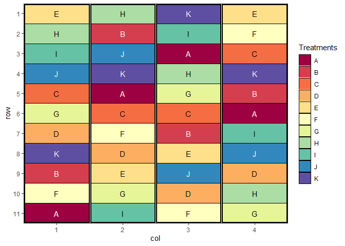

# biometryassist

The goal of biometryassist is to provide functions to aid in the Design
and Analysis of Agronomic-style experiments through easy access to
documentation and helper functions, especially while teaching these
concepts.

*This package is a renamed version of BiometryTraining which is no
longer maintained, but can still be found at
<https://biometryhub.github.io/BiometryTraining/>*

------------------------------------------------------------------------

## Installation

As of version 1.0.0 the biometryassist package is now [on
CRAN](https://cran.r-project.org/package=biometryassist) 🙌 That means
that installation is as easy as running:

``` r

install.packages("biometryassist")
```

### Development version

⚠ **Warning**: The development version is unstable and liable to change
more often than the CRAN version. It may have bugs fixed, but there may
be other currently unknown bugs introduced. ⚠

Use the following code to install the latest development version of this
package.

``` r

if(!require("pak")) install.packages("pak")
pak::pak("biometryhub/biometryassist@dev")

# Alternatively
if(!require("remotes")) install.packages("remotes")
remotes::install_github("biometryhub/biometryassist@dev")
```

## Using the package

Load the package and start using it with:

``` r

library(biometryassist)
```

The package supports two main workflows:

**Experimental design** — generate and visualise trial layouts:

- [`design()`](https://biometryhub.github.io/biometryassist/reference/design.md)
  — create CRD, RCBD, Latin Square, split-plot, strip-plot, and
  factorial designs, with a plot of the layout and a skeletal ANOVA
  table
- [`add_buffers()`](https://biometryhub.github.io/biometryassist/reference/add_buffers.md)
  — add buffer plots around treatment plots, blocks, or the trial
  perimeter
- [`export_design_to_excel()`](https://biometryhub.github.io/biometryassist/reference/export_design_to_excel.md)
  — write a design to a formatted Excel workbook

**Post-model analysis and visualisation** — works with models from
`aov`, `lme4`, `nlme`, `asreml`, `sommer`, `glmmTMB`, `afex`, and more:

- [`multiple_comparisons()`](https://biometryhub.github.io/biometryassist/reference/multiple_comparisons.md)
  — Tukey HSD and other multiple comparison tests with letter groupings
- [`pairwise_comparisons()`](https://biometryhub.github.io/biometryassist/reference/pairwise_comparisons.md)
  — selected pairwise differences or general linear contrasts
- [`reference_comparisons()`](https://biometryhub.github.io/biometryassist/reference/reference_comparisons.md)
  — compare all levels against a reference (Dunnett-style)
- [`resplot()`](https://biometryhub.github.io/biometryassist/reference/resplot.md)
  — diagnostic residual plots
- [`heat_map()`](https://biometryhub.github.io/biometryassist/reference/heat_map.md)
  — spatial heat maps of trial data or residuals
- [`variogram()`](https://biometryhub.github.io/biometryassist/reference/variogram.md)
  — spatial variograms for ASReml-R models

The package optionally enhances the commercial
[ASReml-R](https://vsni.co.uk/software/asreml-r) package. If you have a
licence,
[`install_asreml()`](https://biometryhub.github.io/biometryassist/reference/install_asreml.md)
and
[`update_asreml()`](https://biometryhub.github.io/biometryassist/reference/install_asreml.md)
make it easy to install and keep up to date.

For details on recent changes, see
[NEWS.md](https://biometryhub.github.io/biometryassist/NEWS.md).

### Example

``` r

library(biometryassist)

# Generate a Randomised Complete Block Design with 11 treatments and 4 reps
des.out <- design(
    type = "rcbd",
    treatments = LETTERS[1:11],
    reps = 4,
    nrows = 11,
    ncols = 4,
    brows = 11,
    bcols = 1,
    seed = 42,
    quiet = TRUE
)
```



The `$satab` element gives the skeletal ANOVA table for the design:

``` r

cat(des.out$satab)
#> Source of Variation                     df
#>  =============================================
#>  Block stratum                           3
#>  ---------------------------------------------
#>  treatments                              10
#>  Residual                                30
#>  =============================================
#>  Total                                   43
```

## Troubleshooting Installation

- If you receive an error that the package could not install because
  `rlang` or another package could not be upgraded, the easiest way to
  deal with this is to uninstall the package(s) that could not be
  updated (`remove.packages("rlang")`). Then restart R, re-install with
  `install.packages("rlang")` and then try installing `biometryassist`
  again.

## Citation

If you find this package useful in your work, please cite it. Run the
following in R to get the citation details:

``` r

citation("biometryassist")
```

``` R
#> To cite package 'biometryassist' in publications use:
#> 
#>   Nielsen S, Rogers S, Conway A (2026). _biometryassist: Functions to
#>   Assist Design and Analysis of Agronomic Experiments_. R package
#>   version 1.5.0, <https://biometryhub.github.io/biometryassist/>.
#> 
#> A BibTeX entry for LaTeX users is
#> 
#>   @Manual{,
#>     title = {biometryassist: Functions to Assist Design and Analysis of Agronomic Experiments},
#>     author = {Sharon Nielsen and Sam Rogers and Annie Conway},
#>     year = {2026},
#>     note = {R package version 1.5.0},
#>     url = {https://biometryhub.github.io/biometryassist/},
#>   }
```

## Code of Conduct

Please note that the biometryassist project is released with a
[Contributor Code of
Conduct](https://biometryhub.github.io/biometryassist/CODE_OF_CONDUCT.md).
By contributing to this project, you agree to abide by its terms.

## Contributing

Contributions are welcome! Please see
[CONTRIBUTING.md](https://biometryhub.github.io/biometryassist/CONTRIBUTING.md)
for guidelines on how to get involved.

## Licence

MIT © University of Adelaide Biometry Hub. See
[LICENSE.md](https://biometryhub.github.io/biometryassist/LICENSE.md)
for details.
